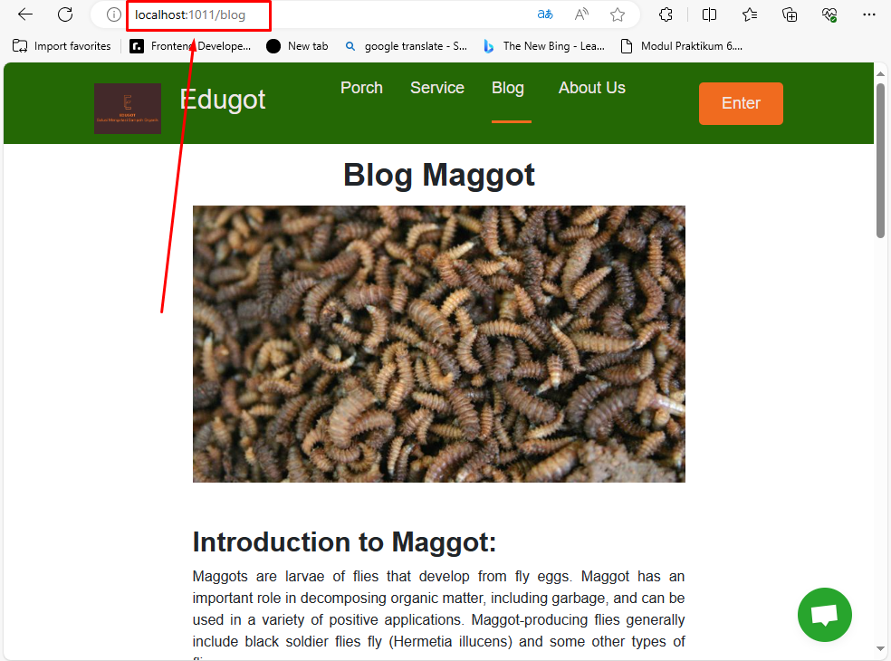

# Deployment Website Edugot ke Dalam Kontainer

## Instalasi
1. Docker Engine


## <b>Struktur Folder</b>
<pre>
|── Deployment
|   ├── src
|   │   ... (kode Laravel)
|   ├── php
|   │       local.ini
|   ├── mysql
|   │       my.cnf
|   └── nginx|
|   │       app.conf     
|── Dockerfile
└── docker-compose.yml
</pre>

## Cara Penggunaan

1. `docker compose build`
2. `docker compose up -d`
3.  **Masuk kontainer php**
    ```bash
    docker-compose exec php /bin/bash
    ```
   
    3.1. Jalankan `composer install` atau `composer update`.
   
    3.2. Salin file `.env` dari `.env.example`:
        ```bash
        cp .env.example .env
        ```

        Ubah nilai-nilai berikut dalam file `.env`:
        ```dotenv
        DB_CONNECTION=mysql
        DB_HOST=db
        DB_PORT=3306
        DB_DATABASE=edugot_db
        DB_USERNAME=root
        DB_PASSWORD=admin
        ```

    3.3. Jalankan:
        ```bash
        php artisan key:generate
        ```

    3.4. Jalankan:
        ```bash
        php artisan storage:link
        ```

    3.5. Jalankan:
        ```bash
        php artisan cache:clear
        ```

4. Import database 
5. Untuk menjalankan website pada browser, buka [http://localhost:1011](http://localhost:1011)


## Repositori DockerHub
 https://hub.docker.com/repository/docker/lffdevops/capstone_dicoding

## Hasilnya


